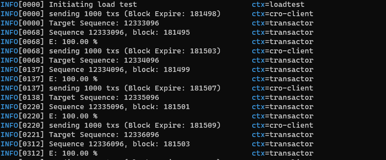

# cro-load-test

`cro-load-test` is a tool for load
testing [Crypto.com Crossfire](https://chain.crypto.com/crossfire) networks based on [tm-load-test](https://github.com/informalsystems/tm-load-test).

## Requirements
In order to build and use the tools, you will need:

* Go 1.13+
* `make`

## Building
To build the `cro-load-test` binary in the `build` directory:

```bash
make build
```

## Usage
`cro-load-test` can be executed in **standalone** mode

### Standalone Mode
In standalone mode, `cro-load-test` operates in a similar way to `tm-bench`.
This tool sends `cosmos-sdk/MsgModifyWithdrawAddress` msg.

Require `WALLET` and `CHAINID` environment variables.

```bash
# wallet paraphrase
export WALLET="dss hgg ssa yyrre ere ere erre ..."
export CHAINID=crossfire
cro-load-test -b 5 -r 1000 \
    --broadcast-tx-method async \
    --endpoints ws://127.0.0.1:26657/websocket \
    --gas 200000 --gas-prices 0.2basetcro
```

- `-b`: Max block to wait txs complete
- `-r`: Txs in batch transaction

Example `-b 8 -r 1000`:




To see a description of what all of the parameters mean, simply run:

```bash
cro-load-test --help
```

## Development
To run the linter and the tests:

```bash
make lint
make test
```

